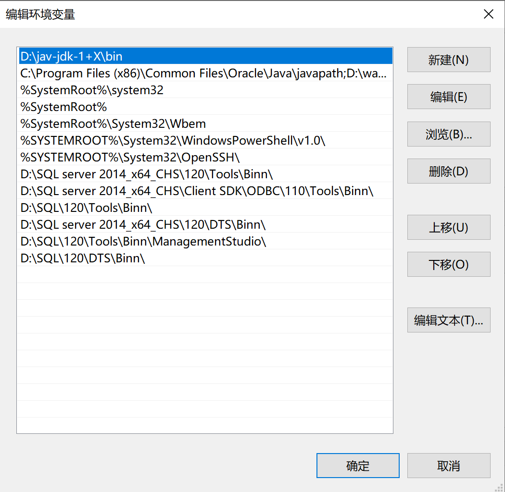

# 一、系统配置
## 1.1path配置
- path:路径
在系统环境变量的path中配置路径：

```
D:\jav-jdk-1+X\bin
该路径为jdk的安装路径
```


### 1.1.1path配置的应用
- 下载网页视频
```java
E:\annie -i 视频路径 //可查询到视频下载的清晰度

download with annie -f fhd(清晰度-高清) 视频路径
```

## 1.2classpath:类路径

### 1.2.1应用：使用java操作ececl-poi
- 要求：将java程序的执行结果输出到execl中
- 下载地址：
```
https://www.apache.org/dyn/closer.lua/poi/release/bin/poi-bin-4.1.2-20200217.zip
```

- 代码实现：

```java
import java.io.FileOutputStream;
import java.text.ParseException;
import java.text.SimpleDateFormat;
import java.util.Date;
import java.util.LinkedList;
import java.util.List;

import org.apache.poi.hssf.usermodel.HSSFCell;
import org.apache.poi.hssf.usermodel.HSSFCellStyle;
import org.apache.poi.hssf.usermodel.HSSFRow;
import org.apache.poi.hssf.usermodel.HSSFSheet;
import org.apache.poi.hssf.usermodel.HSSFWorkbook;

/**
 * Description:
 * 作者：gu.weidong(Jack)
 * date:2018年9月27日
 * ProjectName:ExcelExport
 */
public class WriteExcel {
    public static void main(String[] args) throws ParseException {
        //创建一个HSSF,对应一个excel
        HSSFWorkbook workbook = new HSSFWorkbook();
        //在webbook中添加一个sheet,对应Excel文件中的sheet
        HSSFSheet sheet = workbook.createSheet("学生表");
        //在sheet中添加表头第0行,注意老版本poi对Excel的行数列数有限制short
        HSSFRow row = sheet.createRow((int) 0);
        //创建单元格，并设置值表头 设置表头居中
        HSSFCellStyle style = workbook.createCellStyle();

        HSSFCell cell = row.createCell(0);
        cell.setCellValue("学号");
        cell.setCellStyle(style);
        cell = row.createCell(1);
        cell.setCellValue("姓名");
        cell.setCellStyle(style);
        cell = row.createCell(2);
        cell.setCellValue("年龄");
        cell.setCellStyle(style);
        cell = row.createCell(3);
        cell.setCellValue("生日");
        cell.setCellStyle(style);

        //写入实体数据
        //      List list = DemoDaoImpl.getStudent();
        List list = new LinkedList<>();
        list.add(1);
        list.add(2);
        list.add(2);
        list.add(2);
        list.add(2);
        for (int i = 0; i < list.size(); i++) {
            row = sheet.createRow((int) i + 1);
            //     Student stu = (Student) list.get(i);
            //创建单元格，并设置值
            row.createCell(0).setCellValue(i);
            row.createCell(1).setCellValue("Jack");
            row.createCell(2).setCellValue(20);
            cell = row.createCell(3);
            cell.setCellValue(new SimpleDateFormat("yyyy-MM-dd").format(new Date()));
        }
        //将文件存到指定位置
        try {
            FileOutputStream fout = new FileOutputStream("E:/学生表.xls");
            workbook.write(fout);
            fout.close();
        } catch (Exception e) {
            e.printStackTrace();
        }
    }
}
```

# 二、变量、流程控制
## 2.1、标识符、数据类型
### 2.1.1 基本类型（8）
- 整型：

①：byte：8位（-2的7次方~2的7次方-1）-128~127

②：short：16位（-2的15次方~2的15次方-1）
-32768~32767‬

③：int：36位（-2的31次方~2的31次方-1）-2147483648~2,147483648

④：long

- 浮点型：float、double

- 字符：char

- 布尔：Boolean

### 2.1.2引用类型

- 类：class

- 接口:interface

- 数组:

一维数组：

    数据类型[] 数组名称=new 数据类型[]{0};

    数据类型[] 数组名称=new 数据类型[3];


二维数组：

    数据类型[][] 数组名称=new 数据类型[][]{0};

    数据类型[][] 数据名称=new 数据类型[2][];

## 2.2声明变量和赋值

- 2.2.1声明变量

数据类型 变量名称；

    int a;

- 变量赋值

    a=0;

## 2.3流程控制

### 2.3.1程序可以做某事
```java
//创建一个购物系统
import java.util.Scanner;

public class Test {


    public static void main(String[] agre){
        //购物系统
        Scanner reader=new Scanner(System.in);
        System.out.println("请输入用户名：");
        String username=reader.next();
        System.out.println("请输入密码：");
        String password=reader.next();

        while (true){
            System.out.println("——————————目录———————————");
            System.out.println("\n");
            System.out.println("输入1开始购物");
            System.out.println("输入2进入购物车");
            System.out.println("输入3结算订单");
            System.out.println("输入4退出程序");

            System.out.println("\n");
            System.out.println("请输入所选择的菜单");
            int change=reader.nextInt();

            if (change==1){
                System.out.println("开始购物");
            }else if (change==2){
                System.out.println("进入购物车");
            }else if (change==3){
                System.out.println("开始结算订单");
            }else if (change==4){
                break;
            }
        }
    }
}
```


### 2.3.2程序在某个条件下可以做某事

- if...else

- if...else if

### 2.3.3程序可以循环做某事

- for：

在能够明确循环次数时使用
```java
for(int i=0;i<2;i++){
    java代码块
}
```

```java
//打印出某目录下的所有文件
import java.io.File;

public class ShowFile {
    public static void main(String[] args) {
        File file =new File("F:\\a");
        File files[]=file.listFiles();
        for(File f:files){
            System.out.println("第1层，当前目录下的文件"+f.getName());
            if(f.isDirectory()){
                File files01[]=f.listFiles();
                for(File f01:files01){
                    System.out.println("第2层，当前目录下的文件"+f01.getName());
                }
            }
        }
        m1();
        m2();
        m3(3);
    }
    static int a=0;
    public static void m1(){
        /*
        递归出口
         */
        a++;
        if(a>500){
            return;
        }
        m1();
    }
    public static void m2(){
        System.out.println("方法的结束标识");
        return;
    }
    public static int m3(int a){
        if(a==3){
            return 5;
        }
        System.out.println("hihi");
        return 0;
    }
}
```

- while

在不明确循环次数时使用

```java
int i=0;
while(i<2){
    i++;
}
```

- do...while

相较于while循环而言，do...while循环会比while循环多循环一次，先执行一遍do...while循环中的内容再判断while()中的内容，决定是否继续循环

```java
int i=0;
do{
    i++;
}while(i<2)
```
### 2.3.4程序何时结束

main线程结束，意味着jvm的退出

- break：跳出循环
在main方法中，如果跳出循环后不再有其他可执行的语句，则相当于结束进程。

- return：返回方法值

void:返回时为空，或者不返回。

return;

非空：int ,char,String....等数据类型

return 3;

当return语句正常执行后，表示直接结束进程

# 三、方法

## 3.1方法概念和语法

- 格式

```
返回类型 方法名称(【参数1】,【参数2】.....){
    方法体
}
```

# 四、前四章综合案例

- 标识符
- 变量
- 流程控制
- 一维数组
- 二维数组
- 方法

编程的本质：调用方法

## 实例：小游戏
### 4.1、显示hero在屏幕上

- 知识点
```
声明变量
变量赋值
```

```java
class MainCanvas extends Canvas
{
	Image img;//变量的声明
	public MainCanvas(){
		try
		{
			img=Image.createImage("/sayo10.png");//变量赋值
		}
		catch (IOException e)
		{
			e.printStackTrace();
		}
	}
	public void paint(Graphics g){
		g.setColor(250,200,180);
		g.fillRect(0,0,getWidth(),getHeight());
		g.drawImage(img,100,100,0);
	}
}
```
### 4.2、让hero可以四个方向走动

- 声明hero的x坐标和y坐标
```java
int x,y;
```
- 给x和y赋初值

```java
x=100;
y=100;
```

- 把drawImage中的100和100替换为x和y

```java
g.drawImage(img,x,y,0);//第1个100是x坐标，第2个100是y坐标
```

- 在keyPressed中对x坐标和y坐标进行加减操作

```java
if(action==LEFT){
    System.out.println("向左走");
    x=x-1;
}
else if(action==RIGHT){
    System.out.println("向右走");
    x=x+1;
}
else if(action==UP){
    System.out.println("向上走");
    y=y-1;
}
else if(action==DOWN){
    System.out.println("向下走");
    y=y+1;
}
repaint();
```
### 4.3、让hero自然走动（两个图片来回切换）

- 声明变量
- 流程控制之if...else

思路分析

```
声明1个变量，我们来回改变该变量的值，不同的值显示不同的图片
例如：int f;
如果f是1，则显示sayo00.png
如果f是2，则显示sayo20.png
```

代码实例
```java
import javax.microedition.lcdui.*;
import javax.microedition.midlet.*;
import java.io.*;
import java.util.*;

public class AI extends MIDlet
{
	Display display;
	MainCanvas mc;
	public AI(){
		display=Display.getDisplay(this);
		mc=new MainCanvas();
		display.setCurrent(mc);
	}
	public void startApp(){
	}
	public void destroyApp(boolean unc){
	}
	public void pauseApp(){
	}
}
class MainCanvas extends Canvas implements Runnable
{
	Thread thread;
	int heroX,heroY,bossX,bossY;
	int flag;
	Image heroImg[][]=new Image[4][3];
	Image bossImg;
	Random rd=new Random();
	Image currentImg;

	public MainCanvas(){
		try
		{
			for(int i=0;i<heroImg.length;i++){
				for(int j=0;j<heroImg[i].length;j++){
					heroImg[i][j]=Image.createImage("/sayo"+i+j+".png");
				}
			}
			bossImg=Image.createImage("/zuzu000.png");
			currentImg=heroImg[3][1];
			heroX=120;
			heroY=100;

			bossX=0;
			bossY=0;

			flag=1;
			
			thread=new Thread(this);
			thread.start();
		}
		catch (IOException e)
		{
			e.printStackTrace();
		}
	}
	public void run(){
		while(true){
			int rdNumber=rd.nextInt(10);
			
			try
			{
				Thread.sleep(200);
			}
			catch(InterruptedException e){
				e.printStackTrace();
			}
			if(rdNumber%3==0){
				if(bossX<heroX){
					bossX++;
				}
				else{
					bossX--;
				}

				if(bossY<heroY){
					bossY++;
				}else{
					bossY--;
				}
			}
			repaint();
		}
	}
	public void paint(Graphics g){
		g.setColor(250,200,180);
		g.fillRect(0,0,getWidth(),getHeight());
		g.drawImage(currentImg,heroX,heroY,0);
		g.drawImage(bossImg,bossX,bossY,0);
	}
	public void keyPressed(int keyCode){
		int action=getGameAction(keyCode);
		if(action==LEFT){
			changePicAndDirection(0);
			heroX=heroX-1;
		}
		if(action==UP){
			changePicAndDirection(2);
			heroY=heroY-1;
		}
		if(action==RIGHT){
			changePicAndDirection(1);
			heroX=heroX+1;
		}
		if(action==DOWN){
			changePicAndDirection(3);
			heroY=heroY+1;
		}
	}
	void changePicAndDirection(int direction){
		if(flag==1){
			currentImg=heroImg[direction][0];
			flag++;
		}
		else if(flag==2){
			currentImg=heroImg[direction][2];
			flag=1;
		}
	}
}
```